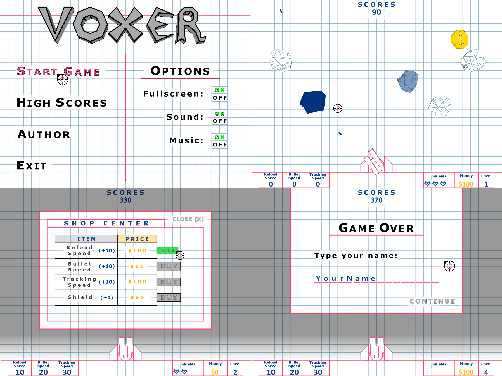

# Voxer

3D game with 2D view where you are shooting meteoroids.

Technologies: C++, SDL2, OpenGL.

## Objective and game mechanics

The object of the game is to defend the bottom margin of the page from the paper meteoroids rolling towards it.

Each meteoroid is characterized by durability, speed, size and direction of movement. The more damaged it is, the slower it rolls.

The only defense mechanism is an ink-shooting cannon, which can be upgraded with money collected during the game.

The page margin is equipped with up to four shields that protect it from individual meteoroids.

After completing each level, a shop appears.

Items in the shop:

| Type           | Max | Quantity | Price |
| -------------- | --- | -------- | ----- |
| Reload Speed   | 150 | +10      | $100  |
| Bullet Speed   | 100 | +10      | $100  |
| Tracking Speed | 100 | +10      | $100  |
| Shield         | 4   | +1       | $50   |

After completing all the available levels, they start to repeat and meteoroids have increased durability.

The top ten scores from the games are displayed in the High Scores tab.

## Controls

The movement of the cannon is based on following the mouse cursor (crosshair).

To shoot, press left mouse button (LMB). Hold LMB to fire a continuous burst.

### Additional options

- F1 - enable/disable free camera mode
- F2 - enable/disable FPS counter display
- F3 - enable/disable V-Sync

### Free camera controls

- W, A, S, D - forward, left, backward, right
- E, Q - up, down
- Arrows - camera rotation, relative to the Y axis (left and right arrows), relative to the X axis (up and down arrow)
- J, K - camera rotation, relative to the Z axis
- P - enable/disable camera rotation with the mouse
- O - enable/disable smooth camera rotation with the mouse
- Spacebar - reset the position and rotation of the camera

## Options

Game settings available from the main menu:

- Fullscreen [ON/OFF] - enable/disable full screen mode
- Sound [ON/OFF] - enable/disable sounds
- Music [ON/OFF] - enable/disable music
